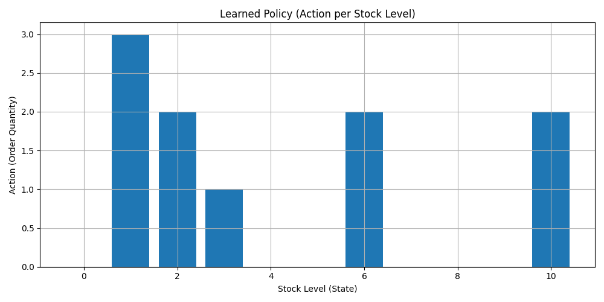
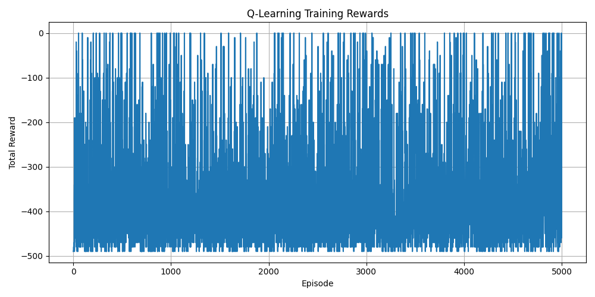

# rl-stock-optimization

A small reinforcement-learning demo that uses Q-learning to learn an ordering policy for a simple stock/inventory environment.

This repository contains a minimal implementation and example run that trains a Q-learning agent to decide how much stock to order at each timestep for a toy environment. The training process produces two example plots (policy and rewards) stored in the `assets/` folder.

## Example Results

After training, two plots are generated and saved in the `assets/` directory:

### Learned Policy



_Shows the agent's learned ordering policy for different inventory states. This plot visualizes how the agent decides the optimal stock order at each timestep._

### Training Rewards



_Displays the cumulative rewards received during training. This plot helps track the agent's learning progress and performance over time._

## Quick start

1. Install the project dependencies:

```bash
uv sync
```

2. Run the training script:

```bash
uv run main.py
```

The script will train a Q-learning agent and save example plots into the `assets/` directory.

## License

This project is covered by the terms in the `LICENSE` file in the repository root.
